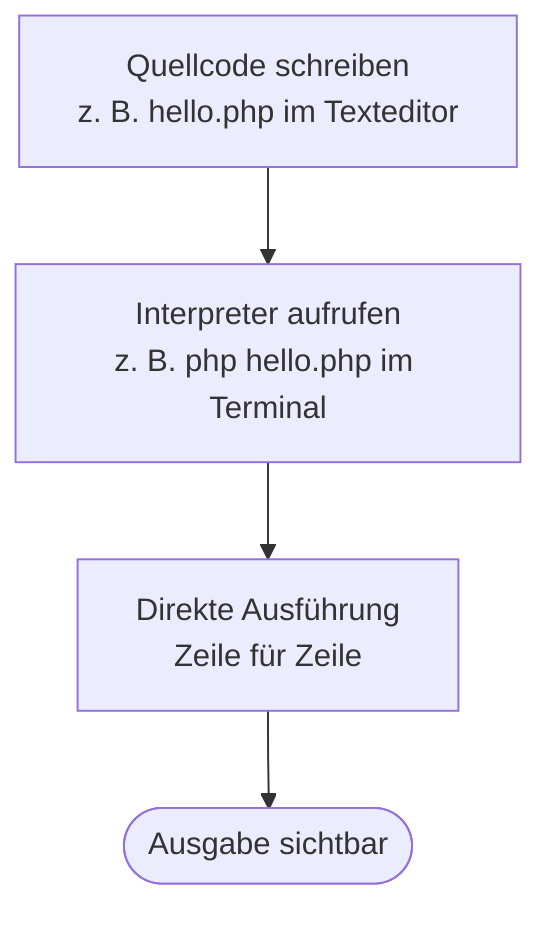
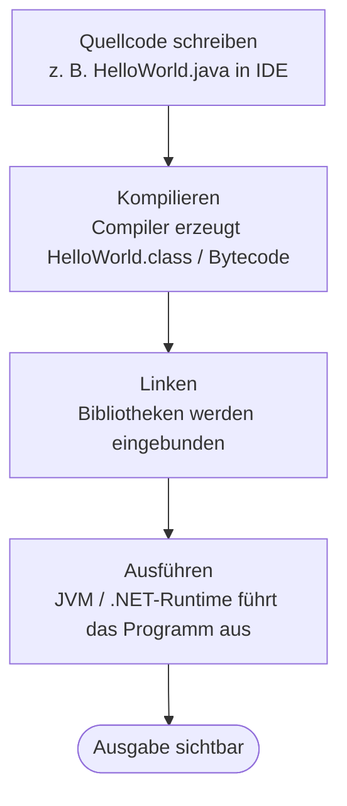

# Kapitel 10 – Grundlagen der Programmierung

<div class="kurs-progress">
  <div class="step done"></div>
  <div class="step done"></div>
  <div class="step done"></div>
  <div class="step done"></div>
  <div class="step done"></div>
  <div class="step done"></div>
  <div class="step done"></div>
  <div class="step done"></div>
  <div class="step done"></div>
  <div class="step active"></div>
</div>

<div class="lernziele" markdown>
<h3>Was du in diesem Kapitel lernst</h3>

- Wie ein einfaches Programm grundlegend aufgebaut ist (Variablen, Datentypen, Operatoren, Kontrollstrukturen)
- Wie ein „Hello World"-Programm in PHP aussieht und was jede Zeile bedeutet
- Was die wesentlichen Schritte von der Quelle zum ausführbaren Programm sind
- Wie Hello World in verschiedenen Sprachen verglichen werden kann (PHP, Python, Java)
</div>

---

## So gehst du vor

1. Lies die Kapitelinhalte und lies den Code aufmerksam – du musst ihn nicht tippen, sondern verstehen.
2. Bearbeite die **Kurzübungen** der Reihe nach – von Grundlagen bis Experte.
3. Arbeite die **Workshop-Aufgabe** durch. Sie vertieft das Gelernte an einem zusammenhängenden Szenario.

---

## 10.1 Aufbau eines Programms

Ein Programm ist eine **geordnete Folge von Anweisungen**, die ein Computer ausführen kann. Jede Anweisung wird nacheinander verarbeitet – es sei denn, Kontrollstrukturen verändern den Ablauf.

Die **Grundbausteine** fast jedes Programms sind:

| Baustein | Beschreibung |
|---|---|
| **Variablen** | Benannte Speicherplätze für Werte |
| **Datentypen** | Legen fest, welche Art von Wert gespeichert wird |
| **Operatoren** | Führen Berechnungen und Vergleiche durch |
| **Kontrollstrukturen** | Steuern den Ablauf (Bedingungen, Schleifen) |
| **Funktionen** | Wiederverwendbare Codeblöcke |
| **Kommentare** | Erläuterungen im Code (werden nicht ausgeführt) |

Alle Codebeispiele in diesem Kapitel sind in **PHP** geschrieben. PHP ist eine serverseitige Skriptsprache, die im Web weit verbreitet ist und eine gut lesbare, imperative Syntax bietet.

!!! info "PHP-Grundregel"
    Jede PHP-Datei beginnt mit `<?php`. Anweisungen enden mit einem Semikolon `;`. PHP ist eine Interpretersprache – es wird kein separater Kompilierungsschritt benötigt.

---

## 10.2 Variablen und Datentypen

### Variablen in PHP

In PHP beginnen Variablennamen immer mit einem `$`-Zeichen, gefolgt vom Namen. PHP ist **dynamisch typisiert**: Der Datentyp wird automatisch aus dem zugewiesenen Wert abgeleitet.

```php
<?php
$vorname = "Maria";       // String (Zeichenkette)
$alter = 28;              // Integer (ganze Zahl)
$gehalt = 3250.50;        // Float (Dezimalzahl)
$istAngemeldet = true;    // Boolean (wahr/falsch)
$adresse = null;          // Null (kein Wert)
```

### Datentypen im Überblick

| Typ | PHP-Beispiel | Beschreibung |
|---|---|---|
| **String** | `"Hallo Welt"` | Text, in Anführungszeichen |
| **Integer** | `42` | Ganze Zahl |
| **Float** | `3.14` | Dezimalzahl |
| **Boolean** | `true` / `false` | Wahrheitswert |
| **Array** | `[1, 2, 3]` | Liste von Werten |
| **Null** | `null` | Kein Wert (Platzhalter) |

### Benennung von Variablen

Gute Variablennamen sind:
- **Aussagekräftig:** `$kundenname` statt `$x`
- **Konsistent:** Entweder immer camelCase (`$kundenName`) oder Unterstrich (`$kunden_name`)
- **Kein reserviertes Wort:** `$echo`, `$if`, `$while` sind nicht erlaubt

---

## 10.3 Operatoren

Operatoren verarbeiten Werte und liefern ein Ergebnis.

### Arithmetische Operatoren

```php
<?php
$a = 10;
$b = 3;

$summe      = $a + $b;   // 13
$differenz  = $a - $b;   // 7
$produkt    = $a * $b;   // 30
$quotient   = $a / $b;   // 3.333...
$rest       = $a % $b;   // 1 (Modulo – Rest der Division)
```

### Vergleichsoperatoren

Vergleiche liefern immer `true` oder `false`.

| Operator | Bedeutung | Beispiel | Ergebnis |
|---|---|---|---|
| `==` | Gleich (Wert) | `5 == "5"` | `true` |
| `===` | Identisch (Wert + Typ) | `5 === "5"` | `false` |
| `!=` | Ungleich | `5 != 6` | `true` |
| `<` | Kleiner als | `3 < 5` | `true` |
| `>` | Größer als | `3 > 5` | `false` |
| `<=` | Kleiner gleich | `5 <= 5` | `true` |
| `>=` | Größer gleich | `6 >= 5` | `true` |

### Logische Operatoren

Verknüpfen mehrere Bedingungen.

| Operator | Bedeutung | Beispiel |
|---|---|---|
| `&&` | Und | `$a > 0 && $b > 0` |
| `\|\|` | Oder | `$a > 0 \|\| $b > 0` |
| `!` | Nicht | `!$istAngemeldet` |

---

## 10.4 Kontrollstrukturen

Kontrollstrukturen steuern, welche Anweisungen ausgeführt werden und wie oft.

### Bedingte Anweisung: if / else

```php
<?php
$alter = 20;

if ($alter >= 18) {
    echo "Zutritt erlaubt.";
} else {
    echo "Zutritt verweigert – unter 18.";
}
```

**Leseweise:** Falls `$alter` größer oder gleich 18 ist, gib „Zutritt erlaubt." aus – sonst „Zutritt verweigert."

### Mehrfachverzweigung: if / elseif / else

```php
<?php
$note = 2;

if ($note == 1) {
    echo "Sehr gut";
} elseif ($note == 2) {
    echo "Gut";
} elseif ($note == 3) {
    echo "Befriedigend";
} else {
    echo "Weitere Prüfung nötig";
}
```

### Fallunterscheidung: switch

```php
<?php
$wochentag = "Montag";

switch ($wochentag) {
    case "Montag":
        echo "Wochenstart";
        break;
    case "Freitag":
        echo "Fast Wochenende!";
        break;
    default:
        echo "Ein gewöhnlicher Tag";
}
```

### Schleife: while

Führt einen Block aus, solange die Bedingung wahr ist.

```php
<?php
$zähler = 1;

while ($zähler <= 5) {
    echo $zähler . "\n";
    $zähler++;   // zähler um 1 erhöhen
}
// Ausgabe: 1 2 3 4 5
```

### Schleife: for

Zählschleife mit bekannter Anzahl von Durchläufen.

```php
<?php
for ($i = 1; $i <= 5; $i++) {
    echo $i . "\n";
}
// Ausgabe: 1 2 3 4 5
```

**Aufbau einer for-Schleife:**
```
for ( Startwert ; Bedingung ; Schrittweite ) { ... }
```

---

## 10.5 Kommentare

Kommentare sind Erläuterungen im Code, die nicht ausgeführt werden. Sie dienen der Lesbarkeit und Dokumentation.

```php
<?php
// Einzeiliger Kommentar – mit zwei Schrägstrichen

/*
   Mehrzeiliger Kommentar
   kann mehrere Zeilen umfassen
*/

$mehrwertsteuer = 0.19;  // 19 % MwSt
```

**Gute Kommentare** erklären das **Warum**, nicht das **Was**:

```php
// Schlecht – beschreibt nur das Offensichtliche:
$preis = $netto * 1.19;  // Preis mit 19% berechnen

// Besser – erklärt den Grund:
$preis = $netto * 1.19;  // Deutsche MwSt; für Sonderregelungen → Abschnitt 4.2
```

---

## 10.6 Hello World – erstes Programm

„Hello World" ist das klassische erste Programm: Es gibt lediglich den Text „Hello, World!" auf dem Bildschirm aus. Es dient dazu, die grundlegende Funktionsweise einer Programmiersprache und die Entwicklungsumgebung zu testen.

### Hello World in PHP

```php
<?php
echo "Hello, World!";
```

**Was passiert Zeile für Zeile:**

| Zeile | Bedeutung |
|---|---|
| `<?php` | PHP-Startmarker – alles danach ist PHP-Code |
| `echo` | Ausgabe-Anweisung – gibt Text auf dem Bildschirm aus |
| `"Hello, World!"` | Der auszugebende Text (String) |
| `;` | Beendet die Anweisung (in PHP verpflichtend) |

### Hello World im Sprachvergleich

Das Konzept ist dasselbe, die Syntax unterscheidet sich:

=== "PHP"
    ```php
    <?php
    echo "Hello, World!";
    ```

=== "Python"
    ```python
    print("Hello, World!")
    ```

=== "Java"
    ```java
    public class HelloWorld {
        public static void main(String[] args) {
            System.out.println("Hello, World!");
        }
    }
    ```

=== "C#"
    ```csharp
    using System;
    class Program {
        static void Main() {
            Console.WriteLine("Hello, World!");
        }
    }
    ```

**Beobachtungen:**
- **PHP und Python:** Sehr kurz, direkt ausführbar – typisch für Skriptsprachen
- **Java und C#:** Mehr Rahmencode (Klasse, Main-Methode) – typisch für Compiler-Sprachen mit strikter Struktur

---

## 10.7 Von der Quelle zum ausführbaren Programm

### Bei Interpreter-Sprachen (PHP, Python)



**Kurzform:** Schreiben → Interpreter starten → Ergebnis sehen

### Bei Compiler-Sprachen (Java, C#)



**Kurzform:** Schreiben → Kompilieren → Ausführen → Ergebnis sehen

### Werkzeuge: Editor vs. IDE

| Werkzeug | Beschreibung | Beispiele |
|---|---|---|
| **Texteditor** | Einfaches Bearbeitungswerkzeug | Notepad++, Sublime Text, VS Code |
| **IDE** (Integrated Development Environment) | Vollständige Entwicklungsumgebung mit Editor, Debugger, Build-System | PhpStorm, Eclipse, IntelliJ IDEA, Visual Studio |

IDEs bieten zusätzliche Funktionen:
- **Syntax-Highlighting:** Schlüsselwörter farblich hervorheben
- **Auto-Vervollständigung:** Vorschläge während der Eingabe
- **Debugger:** Code schrittweise ausführen und Variablen beobachten
- **Build-System:** Kompilieren und Testen auf Knopfdruck

---

## Kurzübungen

{{ task(file="tasks/tag10_01.yaml") }}

{{ task(file="tasks/tag10_02.yaml") }}

{{ task(file="tasks/tag10_03.yaml") }}

---

## Workshop

{{ task(file="tasks/workshop_k10.yaml") }}
