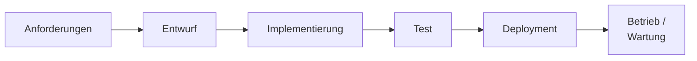

# Kapitel 3 – Phasen der Softwareentwicklung

  

  

  

  

  

  

  

  

  

  

<h3>Was du in diesem Kapitel lernst</h3>

- Welche Phasen ein Softwareprojekt durchläuft (Anforderungen → Entwurf → Implementierung → Test → Deployment → Betrieb/Wartung)
- Welche zentralen Artefakte (Dokumente und Ergebnisse) in jeder Phase entstehen
- Wie die Phasen miteinander zusammenhängen und warum die Reihenfolge wichtig ist

---

## So gehst du vor

1. Lies die Kapitelinhalte und ordne die Phasen und ihre Artefakte einander zu.
2. Bearbeite die **Kurzübungen** der Reihe nach – von Grundlagen bis Experte.
3. Arbeite die **Workshop-Aufgabe** durch. Sie vertieft das Gelernte an einem zusammenhängenden Szenario.

---

## 3.1 Überblick: Der Entwicklungsprozess

Softwareentwicklung ist kein einmaliger Schreibakt, sondern ein **strukturierter Prozess** mit klar definierten Schritten. Unabhängig vom Vorgehensmodell (Kapitel 4) durchlaufen nahezu alle Softwareprojekte dieselben grundlegenden Phasen:

Die Phasen bauen aufeinander auf. Fehler in frühen Phasen – vor allem in der Anforderungsanalyse – sind teuer: Je später ein Fehler entdeckt wird, desto höher ist der Aufwand, ihn zu beheben.

!!! info "Boehm-Kurve"
    Eine bekannte Faustformel aus der Softwareentwicklung besagt: Ein Fehler, der in der Anforderungsphase entdeckt wird, kostet 1 Einheit zur Behebung. Derselbe Fehler in der Testphase kostet ca. 10–100 Einheiten. Nach dem Deployment sogar 100–1000 Einheiten.

---

## 3.2 Phase 1 – Anforderungsanalyse

In dieser Phase wird **was** das System leisten soll, geklärt – nicht wie. Alle Beteiligten (Auftraggeber, Nutzer, Entwickler) erarbeiten gemeinsam, welche Funktionen und Eigenschaften die Software haben muss.

**Aufgaben:**
- Stakeholder identifizieren und befragen
- Anforderungen erheben (Interviews, Workshops, Beobachtungen)
- Anforderungen dokumentieren und priorisieren
- Abnahmekriterien festlegen

**Zentrale Artefakte:**

| Artefakt | Beschreibung |
|---|---|
| **Lastenheft** | Formuliert der Auftraggeber – was soll die Software können? |
| **Pflichtenheft** | Formuliert der Auftragnehmer – wie soll es umgesetzt werden? |
| **Backlog** (agil) | Liste aller Anforderungen, priorisiert nach Wert |
| **Use-Case-Diagramm** | Zeigt, wer (Akteur) was (Funktion) mit dem System tut |

---

## 3.3 Phase 2 – Entwurf (Design)

Nachdem die Anforderungen klar sind, wird die **Architektur und das Design** der Software festgelegt. In dieser Phase entscheidet man, wie das System aufgebaut wird – welche Komponenten es gibt, wie sie interagieren und welche Technologien eingesetzt werden.

**Aufgaben:**
- Systemarchitektur festlegen (Module, Schichten, Schnittstellen)
- Datenbankdesign erstellen
- Benutzeroberflächen entwerfen (Mockups, Wireframes)
- Algorithmen und Datenstrukturen planen

**Zentrale Artefakte:**

| Artefakt | Beschreibung |
|---|---|
| **Architekturdiagramm** | Zeigt die technische Struktur des Systems |
| **Klassendiagramm** (UML) | Modelliert Klassen, Attribute und Beziehungen |
| **ER-Diagramm** | Zeigt die Datenbankstruktur |
| **Wireframes / Mockups** | Skizzen der Benutzeroberfläche |
| **Schnittstellenbeschreibung** | Definiert, wie Komponenten miteinander kommunizieren |

---

## 3.4 Phase 3 – Implementierung

In der Implementierungsphase wird der Code **geschrieben**. Die im Entwurf geplante Architektur wird in einer konkreten Programmiersprache umgesetzt.

**Aufgaben:**
- Quellcode schreiben nach den Vorgaben des Entwurfs
- Code-Reviews durchführen (gegenseitige Prüfung durch Entwickler)
- Versionskontrolle nutzen (z. B. Git)
- Technische Dokumentation schreiben

**Zentrale Artefakte:**

| Artefakt | Beschreibung |
|---|---|
| **Quellcode** | Die eigentliche Implementierung |
| **Technische Dokumentation** | Erläuterungen zu Klassen, Funktionen, Schnittstellen |
| **Commit-History (Git)** | Nachvollziehbare Änderungshistorie |
| **Build-Artefakte** | Kompilierte Dateien, Pakete |

!!! tip "Code lesen lernen"
    Auch ohne eigene Programmiertätigkeit ist das Lesen und Verstehen von Quellcode eine wichtige Kompetenz – z. B. um Fehlerberichte einzuordnen oder mit Entwicklern zu kommunizieren.

---

## 3.5 Phase 4 – Test

Bevor Software ausgeliefert wird, muss sie systematisch getestet werden. Tests prüfen, ob die Software das tut, was sie soll – und ob sie das unter verschiedenen Bedingungen stabil tut.

**Teststufen:**

| Teststufe | Was wird getestet? | Wer testet? |
|---|---|---|
| **Unit-Test** | Einzelne Funktion oder Klasse | Entwickler |
| **Integrationstest** | Zusammenspiel mehrerer Komponenten | Entwickler / QA |
| **Systemtest** | Das Gesamtsystem gegen die Anforderungen | QA-Team |
| **Abnahmetest (UAT)** | Das System aus Sicht des Auftraggebers | Auftraggeber |

**Zentrale Artefakte:**

| Artefakt | Beschreibung |
|---|---|
| **Testplan** | Welche Tests werden wann von wem durchgeführt? |
| **Testfälle** | Konkrete Eingaben und erwartete Ausgaben |
| **Testbericht** | Ergebnisse der Testdurchführung |
| **Bug-Reports** | Dokumentierte Fehler mit Reproduktionsschritten |

---

## 3.6 Phase 5 – Deployment

**Deployment** bezeichnet das Ausrollen der Software auf die Zielumgebung – den Server, den Endnutzer-PC oder die Cloud. Diese Phase umfasst alle Schritte von der Freigabe bis zur produktiven Nutzbarkeit.

**Aufgaben:**
- Software auf Produktivsystem installieren oder bereitstellen
- Datenbank migrieren (bestehende Daten an neues Schema anpassen)
- Nutzer und Administratoren schulen
- Rollback-Plan vorbereiten (für den Fall eines Fehlers)

**Zentrale Artefakte:**

| Artefakt | Beschreibung |
|---|---|
| **Release Notes** | Was ist neu, was wurde behoben? |
| **Installationsanleitung** | Schritt-für-Schritt-Anleitung für das Deployment |
| **Migrationsskript** | Code, der Datenbankänderungen automatisiert |

---

## 3.7 Phase 6 – Betrieb und Wartung

Nach dem Deployment beginnt der Dauerbetrieb. Software muss **gepflegt, überwacht und weiterentwickelt** werden. Diese Phase dauert typischerweise am längsten – oft viele Jahre.

**Arten der Wartung:**

| Typ | Beschreibung |
|---|---|
| **Korrektive Wartung** | Fehler beheben, die im Betrieb auftreten |
| **Adaptive Wartung** | Software an veränderte Rahmenbedingungen anpassen (z. B. neues Betriebssystem) |
| **Perfektive Wartung** | Funktionen verbessern oder neue hinzufügen |
| **Präventive Wartung** | Vorbeugend optimieren, Refactoring, Sicherheitsupdates |

**Zentrale Artefakte:**

| Artefakt | Beschreibung |
|---|---|
| **Betriebshandbuch** | Anleitung für Administratoren |
| **Nutzerhandbuch** | Anleitung für Endanwender |
| **Change Requests** | Dokumentierte Änderungsanforderungen |
| **Monitoring-Berichte** | Protokolle über Systemzustand und Performance |

---

## 3.8 Phasen und Artefakte im Überblick

| Phase | Eingang | Ausgang (Artefakte) |
|---|---|---|
| Anforderungsanalyse | Projektauftrag | Lastenheft, Pflichtenheft, Backlog |
| Entwurf | Pflichtenheft | Architekturdiagramm, ER-Modell, Wireframes |
| Implementierung | Entwurf | Quellcode, technische Dokumentation |
| Test | Quellcode | Testplan, Testberichte, Bug-Reports |
| Deployment | Freigegebener Build | Release Notes, Installationsanleitungen |
| Betrieb/Wartung | Produktivsystem | Change Requests, Handbücher, Updates |

---

## Kurzübungen

{{ task(file="tasks/tag3_01.yaml") }}

{{ task(file="tasks/tag3_02.yaml") }}

{{ task(file="tasks/tag3_03.yaml") }}

---

## Workshop

{{ task(file="tasks/workshop_k3.yaml") }}
