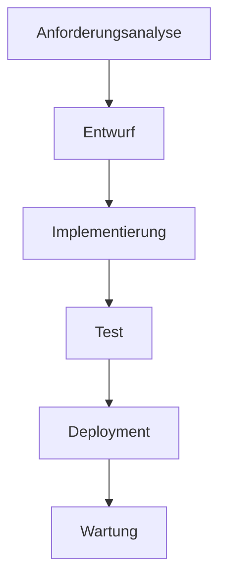
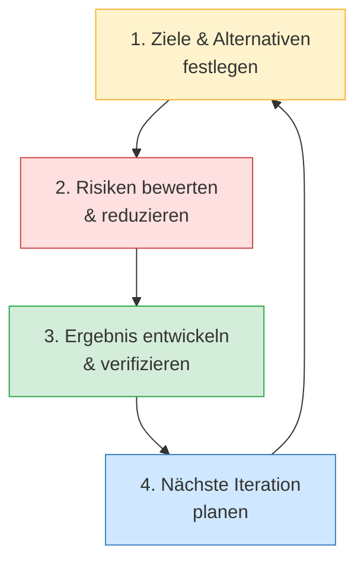

# Kapitel 4 – Vorgehensmodelle

  

  

  

  

  

  

  

  

  

  

<h3>Was du in diesem Kapitel lernst</h3>

- Was ein Vorgehensmodell ist und wozu es dient
- Wie das Wasserfallmodell aufgebaut ist und wann es geeignet ist
- Wie das Spiralmodell funktioniert und welche Risikomanagement-Idee dahintersteckt
- Wie beide Modelle hinsichtlich Risikosteuerung, Feedback-Schleifen und Planbarkeit verglichen werden können

---

## So gehst du vor

1. Lies die Kapitelinhalte und vergleiche beide Modelle aktiv.
2. Bearbeite die **Kurzübungen** der Reihe nach – von Grundlagen bis Experte.
3. Arbeite die **Workshop-Aufgabe** durch. Sie vertieft das Gelernte an einem zusammenhängenden Szenario.

---

## 4.1 Was ist ein Vorgehensmodell?

Ein **Vorgehensmodell** (auch Prozessmodell) beschreibt, in welcher Reihenfolge und nach welchen Regeln die Phasen der Softwareentwicklung durchlaufen werden. Es gibt damit Antworten auf Fragen wie:

- Wann werden Anforderungen erhoben – einmal zu Beginn oder kontinuierlich?
- Wann werden Zwischenergebnisse dem Kunden gezeigt?
- Wie wird mit Änderungen an den Anforderungen umgegangen?
- Wann und wie wird getestet?

Kein Vorgehensmodell passt zu jedem Projekt. Die Wahl hängt von Faktoren wie Projektgröße, Änderungsrisiko, Kundennähe und verfügbaren Ressourcen ab.

---

## 4.2 Das Wasserfallmodell

Das **Wasserfallmodell** ist das älteste und bekannteste Vorgehensmodell. Es wurde in den 1970er-Jahren geprägt und beschreibt die Softwareentwicklung als eine **lineare Abfolge** von Phasen, die – wie Wasser einen Wasserfall hinabfließt – der Reihe nach durchlaufen werden.

Jede Phase muss **abgeschlossen** sein, bevor die nächste beginnt. Am Ende jeder Phase steht ein definiertes Dokument (Meilenstein), das freigegeben wird.

**Stärken des Wasserfallmodells:**

| Stärke | Erklärung |
|---|---|
| Planbarkeit | Zeitplan, Budget und Umfang sind früh festgelegt |
| Klare Dokumentation | Jede Phase erzeugt definierte Dokumente |
| Einfache Steuerung | Klare Meilensteine erleichtern das Projektmanagement |
| Geeignet für feste Anforderungen | Wenn sich Anforderungen kaum ändern, ist der Plan stabil |

**Schwächen des Wasserfallmodells:**

| Schwäche | Erklärung |
|---|---|
| Späteres Feedback | Kunde sieht lauffähige Software erst sehr spät |
| Änderungsresistenz | Nachträgliche Anforderungsänderungen sind teuer |
| Fehler pflanzen sich fort | Ein Fehler in der Analysephase wirkt sich auf alle Folgestufen aus |
| Realitätsfern | In der Praxis sind Anforderungen selten vollständig stabil |

**Wann eignet sich das Wasserfallmodell?**

- Klar definierte, stabile Anforderungen
- Sicherheitskritische Systeme (Luft- und Raumfahrt, Medizintechnik)
- Projekte mit festen Vertragsbestandteilen und staatlicher Regulierung
- Erfahrungswissen über ähnliche Projekte ist vorhanden

---

## 4.3 Das Spiralmodell

Das **Spiralmodell** wurde 1986 von Barry Boehm entwickelt. Es reagiert auf die zentrale Schwäche des Wasserfallmodells: **Risikomanagement wird zur zentralen Aufgabe** des Entwicklungsprozesses.

Statt einer einmaligen linearen Abfolge durchläuft das Projekt mehrere **Iterationen** (Schleifen / Zyklen). Jede Iteration durchläuft vier Quadranten:

**Die vier Quadranten im Detail:**

| Quadrant | Aktivitäten |
|---|---|
| **1. Ziele & Alternativen** | Was soll in dieser Iteration erreicht werden? Welche Alternativen gibt es? |
| **2. Risiken bewerten** | Welche Risiken bestehen? Prototypen erstellen, um Unsicherheiten zu reduzieren |
| **3. Ergebnis entwickeln** | Iterationsziel umsetzen (Entwurf, Code, Test) |
| **4. Nächste Iteration planen** | Überprüfung des Ergebnisses, Planung des nächsten Zyklus |

Mit jeder Iteration rückt die Software dem fertigen Produkt näher. Gleichzeitig sinkt das Risiko, da Unsicherheiten in frühen Zyklen durch Prototypen und Reviews reduziert werden.

**Stärken des Spiralmodells:**

| Stärke | Erklärung |
|---|---|
| Explizites Risikomanagement | Risiken werden in jeder Iteration bewertet und reduziert |
| Frühes Feedback | Prototypen und Zwischenergebnisse zeigen Stakeholdern früh etwas Handfestes |
| Flexibel bei Änderungen | Neue Anforderungen können in der nächsten Iteration aufgegriffen werden |
| Skalierbar | Geeignet für große, komplexe Projekte |

**Schwächen des Spiralmodells:**

| Schwäche | Erklärung |
|---|---|
| Hoher Aufwand | Kontinuierliche Risikoanalysen und Iterationsplanung erfordern Expertise |
| Schwierig zu vertraglich fassen | Kein fester Scope zu Beginn erschwert Festpreisverträge |
| Kann teuer werden | Viele Iterationen bedeuten viele Überprüfungsrunden |
| Weniger geeignet für kleine Projekte | Overhead lohnt sich erst ab einer bestimmten Komplexität |

---

## 4.4 Vergleich: Wasserfall vs. Spiralmodell

| Kriterium | Wasserfallmodell | Spiralmodell |
|---|---|---|
| **Struktur** | Linear, einmalig | Iterativ, zyklisch |
| **Feedback-Schleifen** | Eingeschränkt (meist erst nach Fertigstellung) | Eingebaut – in jeder Iteration |
| **Risikosteuerung** | Gering – Risiken werden kaum explizit behandelt | Hoch – Risiken sind zentrales Thema |
| **Planbarkeit** | Hoch – Budget und Zeit früh definiert | Mittel – Gesamtumfang wächst iterativ |
| **Änderbarkeit** | Gering – Änderungen sind kostspielig | Hoch – Änderungen fließen in nächste Iteration |
| **Dokumentation** | Umfangreiche Phasendokumentation | Dokumentation pro Iteration |
| **Eignung** | Stabile Anforderungen, regulierte Umgebungen | Komplexe, risikobehaftete Projekte |
| **Kundenbeteiligung** | Zu Beginn und am Ende | Kontinuierlich in jeder Iteration |

!!! info "Agile Methoden als Weiterentwicklung"
    Moderne agile Vorgehensmodelle (Scrum, Kanban, XP) bauen auf der Idee des Spiralmodells auf: kurze Iterationen, kontinuierliches Feedback, explizites Risikomanagement. Sie werden im Rahmen dieses Kurses nur überblicksartig erwähnt; eine Vertiefung erfolgt in späteren Modulen.

---

## 4.5 Wann welches Modell?

| Szenario | Empfehlung | Begründung |
|---|---|---|
| Entwicklung eines Röntgengerätes (Medizintechnik) | Wasserfall | Feste Normen, stabile Anforderungen, Zertifizierung erforderlich |
| Neue Unternehmens-App mit unklaren Anforderungen | Spiralmodell / agil | Anforderungen entwickeln sich, frühes Feedback wichtig |
| Erstellung einer Behördendatenbank nach Ausschreibung | Wasserfall | Fester Vertrag, definierter Scope |
| E-Commerce-Plattform für einen Start-up | Spiralmodell / agil | Markt ändert sich schnell, Prototyping wichtig |
| Einmalige Datenmigrationsaufgabe | Wasserfall | Klar definiertes Ziel, einmaliger Prozess |

---

## Kurzübungen

{{ task(file="tasks/tag4_01.yaml") }}

{{ task(file="tasks/tag4_02.yaml") }}

{{ task(file="tasks/tag4_03.yaml") }}

---

## Workshop

{{ task(file="tasks/workshop_k4.yaml") }}
