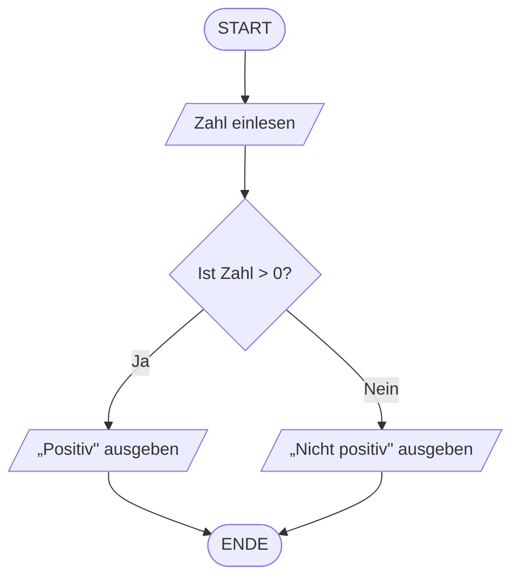
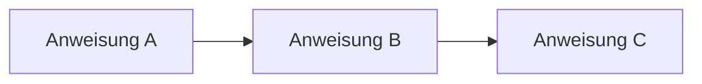
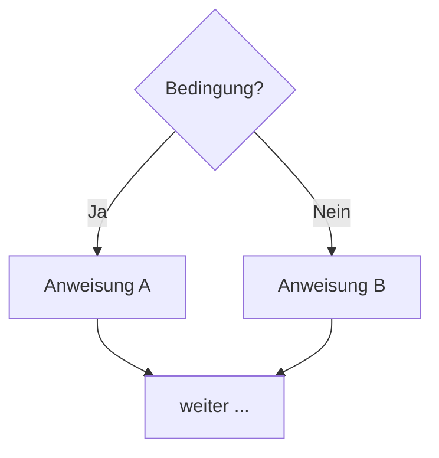
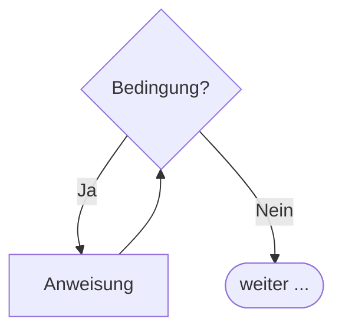

# Kapitel 6 – PAP und Struktogramm

  

  

  

  

  

  

  

  

  

  

<h3>Was du in diesem Kapitel lernst</h3>

- Warum Ablaufmodellierung vor der Programmierung wichtig ist
- Wie ein Programmablaufplan (PAP) aufgebaut ist und welche Symbole verwendet werden
- Was ein Struktogramm (Nassi-Shneiderman-Diagramm) ist und wie es sich vom PAP unterscheidet
- Wie du einfache Algorithmen mit PAP und Struktogramm modellieren kannst

---

## So gehst du vor

1. Lies die Kapitelinhalte und achte auf die Symbole und deren Bedeutung.
2. Bearbeite die **Kurzübungen** der Reihe nach – von Grundlagen bis Experte.
3. Arbeite die **Workshop-Aufgabe** durch. Sie vertieft das Gelernte an einem zusammenhängenden Szenario.

---

## 6.1 Warum Ablaufmodellierung?

Bevor Code geschrieben wird, muss der Ablauf eines Programms **durchdacht und geplant** werden. Ablaufdiagramme helfen dabei:

- Den Algorithmus zu verstehen und zu kommunizieren
- Logikfehler früh zu erkennen (bevor teurer Code geschrieben wurde)
- Mit Personen zu kommunizieren, die keine Programmiersprache lesen können
- Dokumentation zu erstellen, die unabhängig von einer Programmiersprache ist

In der deutschen Informatik-Ausbildung spielen zwei klassische Notationen eine zentrale Rolle: der **Programmablaufplan (PAP)** und das **Struktogramm**.

!!! info "Prüfungsrelevanz"
    In aktuellen IHK-Prüfungen werden vor allem **UML-Aktivitätsdiagramme** abgefragt (Kapitel 8). PAP und Struktogramm sind dennoch wichtige Grundlagen, die das algorithmische Denken schulen und häufig in der Berufsschule und Ausbildung eingesetzt werden.

---

## 6.2 Programmablaufplan (PAP)

Der **Programmablaufplan** (kurz PAP, englisch: *Flowchart*) ist eine grafische Darstellung eines Algorithmus. Er verwendet normierte Symbole (DIN 66001), die miteinander durch Pfeile verbunden werden.

### PAP-Symbole im Überblick

| Symbol (Form) | Name | Bedeutung |
|---|---|---|
| Abgerundetes Rechteck (Oval) | Terminal | Start oder Ende des Programms |
| Rechteck | Prozess / Anweisung | Eine Verarbeitungsoperation (z. B. Berechnung, Zuweisung) |
| Raute | Entscheidung | Verzweigung (Ja/Nein-Frage) |
| Parallelogramm | Ein-/Ausgabe | Daten einlesen oder ausgeben |
| Kreis | Verbindungsstelle | Sprung zu einer anderen Stelle im Diagramm |
| Pfeil | Fluss | Verbindung zwischen Elementen, zeigt die Reihenfolge |

### Beispiel: Prüfen, ob eine Zahl positiv ist

### Kontrollstrukturen im PAP

**Sequenz** – Anweisungen werden der Reihe nach ausgeführt:

**Selektion (Verzweigung)** – Abhängig von einer Bedingung wird ein Pfad gewählt:

**Iteration (Schleife)** – Eine Anweisung wird wiederholt, solange eine Bedingung gilt:

**Vorteile des PAP:**
- Leicht verständlich und intuitiv
- Geeignet für sequenzielle Abläufe
- Unterstützt beliebige Sprünge

**Nachteile des PAP:**
- Kann bei komplexen Programmen unübersichtlich werden
- Sprünge (GOTO) fördern unstrukturierten Code
- Keine Hierarchie erkennbar

---

## 6.3 Struktogramm (Nassi-Shneiderman-Diagramm)

Das **Struktogramm** (auch Nassi-Shneiderman-Diagramm, NSD) wurde 1973 entwickelt. Es ist die strukturierte Alternative zum PAP: Es erlaubt **keine Sprünge** (kein GOTO) und erzwingt damit eine sauberere Programmstruktur.

Ein Struktogramm ist ein **Rechteck**, das in Blöcke unterteilt ist. Jeder Block steht für eine Kontrollstruktur.

### Struktogramm-Elemente

**Anweisung** – einfaches Rechteck:

  
Anweisung

**Selektion (einfache Verzweigung):**

  
Bedingung?

  

    

      
Ja

      
Anweis. A

    

    

      
Nein

      
Anweis. B

    

  

**Iteration (Schleife mit Vorbedingung – WHILE):**

  
Solange Bedingung gilt

  

    
Anweisung

  

**Iteration (Schleife mit Nachbedingung – DO WHILE):**

  

    
Anweisung

  

  
Solange Bedingung gilt

### Beispiel: Prüfen, ob eine Zahl positiv ist

  
Zahl einlesen

  
Ist Zahl > 0?

  

    

      
Ja

      
„Positiv" ausgeben

    

    

      
Nein

      
„Nicht positiv" ausgeben

    

  

**Vorteile des Struktogramms:**
- Erzwingt strukturierte Programmierung (kein GOTO)
- Kompakte Darstellung
- Hierarchie des Programms gut sichtbar

**Nachteile des Struktogramms:**
- Ungewohnte Notation für Einsteiger
- Bei tiefer Verschachtelung wird das Diagramm sehr komplex

---

## 6.4 Vergleich: PAP vs. Struktogramm

| Merkmal | PAP | Struktogramm |
|---|---|---|
| **Notation** | Symbole mit Pfeilen | Verschachtelte Rechtecke |
| **Sprünge (GOTO)** | Möglich | Nicht vorgesehen |
| **Intuitivität** | Sehr hoch | Mittel |
| **Strukturerzwingung** | Gering | Hoch |
| **Kompaktheit** | Gering (viel Platz) | Hoch |
| **Eignung für Anfänger** | Sehr gut | Gut |
| **Prüfungsrelevanz** | Mittel | Mittel |
| **In moderner Praxis** | Selten | Selten |

!!! tip "Beide Notationen üben"
    Obwohl PAP und Struktogramm in moderner Software-Dokumentation seltener eingesetzt werden, sind sie wichtige Werkzeuge zum **algorithmischen Denken**. Das Erstellen und Lesen dieser Diagramme schult das strukturierte Problemlösen.

---

## 6.5 Typische Algorithmus-Bausteine erkennen

Unabhängig von der Notation enthalten fast alle Programme dieselben Grundbausteine:

| Baustein | Beschreibung | Beispiel |
|---|---|---|
| **Sequenz** | Anweisungen werden der Reihe nach ausgeführt | A → B → C |
| **Selektion** | Abhängig von einer Bedingung wird verzweigt | if/else |
| **Einfache Iteration** | Block wird wiederholt, solange Bedingung gilt | while-Schleife |
| **Zählschleife** | Block wird eine feste Anzahl ausgeführt | for-Schleife |
| **Unterprogramm** | Ein wiederverwendbarer Programmblock | Funktion / Methode |

---

## Kurzübungen

{{ task(file="tasks/tag6_01.yaml") }}

{{ task(file="tasks/tag6_02.yaml") }}

{{ task(file="tasks/tag6_03.yaml") }}

---

## Workshop

{{ task(file="tasks/workshop_k6.yaml") }}
