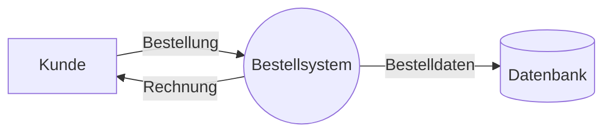
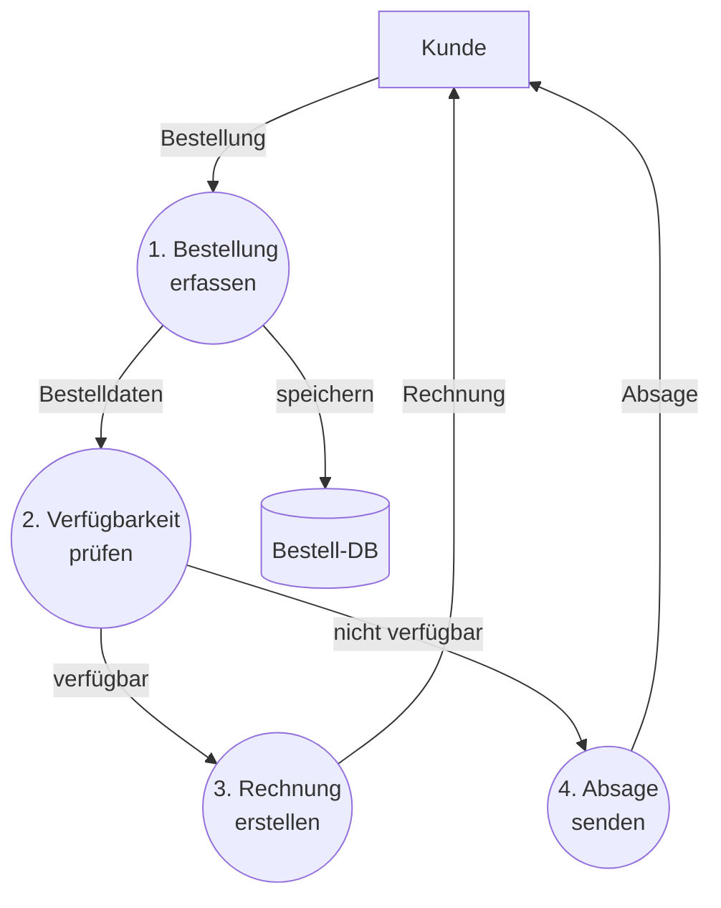

# Kapitel 7 – Datenflussplan und Entscheidungstabelle

  

  

  

  

  

  

  

  

  

  

<h3>Was du in diesem Kapitel lernst</h3>

- Was ein Datenflussplan ist und welche Symbole er verwendet
- Wie eine Entscheidungstabelle aufgebaut ist und wann sie besonders nützlich ist
- Wie du für eine gegebene Aufgabe die passende Modellierungsform wählst
- Was ein UML-Aktivitätsdiagramm ist – als Ausblick auf aktuelle Prüfungsthemen

---

## So gehst du vor

1. Lies die Kapitelinhalte und arbeite die Beispiele aktiv durch.
2. Bearbeite die **Kurzübungen** der Reihe nach – von Grundlagen bis Experte.
3. Arbeite die **Workshop-Aufgabe** durch. Sie vertieft das Gelernte an einem zusammenhängenden Szenario.

---

## 7.1 Datenflussplan (DFD)

Der **Datenflussplan** (auch Datenflussprogramm, DFP; englisch: *Data Flow Diagram*, DFD) modelliert, wie **Daten durch ein System fließen** – nicht den Ablauf von Anweisungen, sondern die **Transformation von Daten**.

Ein DFD beantwortet die Fragen: Woher kommen die Daten? Was passiert mit ihnen? Wohin gehen sie?

### DFD-Symbole

| Symbol (Form) | Name | Bedeutung |
|---|---|---|
| Kreis / Blase | Prozess | Eine Verarbeitung, die Daten transformiert |
| Pfeil | Datenfluss | Bewegung von Daten zwischen Elementen |
| Rechteck | Externe Einheit | Quelle oder Senke von Daten (außerhalb des Systems) |
| Offenes Rechteck / Strich | Datenspeicher | Stelle, wo Daten dauerhaft gespeichert werden |

### Ebenen eines DFD

DFDs werden oft in **Ebenen** aufgebaut:

- **Kontextdiagramm (Level 0):** Zeigt das Gesamtsystem als eine einzige Blase und alle externen Einheiten
- **Level 1:** Zerlegt das System in Hauptprozesse
- **Level 2:** Verfeinert einzelne Prozesse weiter

### Beispiel: Bestellsystem (Kontextdiagramm)

### Beispiel: Bestellsystem (Level 1)

**Vorteile des DFD:**
- Fokus auf Daten, nicht auf Anweisungen
- Gut geeignet für Systemanalyse und Anforderungserhebung
- Leicht von Nicht-Technikern verstanden

**Abgrenzung zum PAP:**
Der PAP beschreibt den **Ablauf von Anweisungen** (Was tut das Programm?). Das DFD beschreibt den **Fluss von Daten** (Wohin fließen die Daten?).

---

## 7.2 Entscheidungstabelle

Eine **Entscheidungstabelle** ist eine tabellarische Methode, um komplexe **Kombinationen von Bedingungen und Aktionen** vollständig und übersichtlich darzustellen.

Sie ist besonders nützlich, wenn mehrere Bedingungen gleichzeitig relevant sind und viele mögliche Kombinationen berücksichtigt werden müssen.

### Aufbau einer Entscheidungstabelle

Eine Entscheidungstabelle besteht aus vier Bereichen:

| | **R1** | **R2** | **R3** | **R4** |
|---|:---:|:---:|:---:|:---:|
| **Bedingungen** | | | | |
| Bedingung 1 | J | J | N | N |
| Bedingung 2 | J | N | J | N |
| **Aktionen** | | | | |
| Aktion 1 | X | | X | |
| Aktion 2 | | X | | X |

- **Bedingungsteil (oben):** Liste aller relevanten Bedingungen mit J(a)/N(ein)-Kombinationen
- **Aktionsteil (unten):** Liste aller möglichen Aktionen; X markiert, welche Aktion ausgeführt wird
- **Regelspalten (R1, R2…):** Jede Spalte ist eine mögliche Kombination (Regel)

Die maximale Anzahl an Regeln bei n Bedingungen beträgt \(2^n\).

### Beispiel: Rabattberechnung

Ein Online-Shop gewährt Rabatt unter folgenden Bedingungen:
- Ist der Kunde Stammkunde?
- Beträgt der Bestellwert mehr als 100 €?

| | **R1** | **R2** | **R3** | **R4** |
|---|:---:|:---:|:---:|:---:|
| **Bedingungen** | | | | |
| Kunde ist Stammkunde | J | J | N | N |
| Bestellwert > 100 € | J | N | J | N |
| **Aktionen** | | | | |
| 15 % Rabatt gewähren | X | | | |
| 10 % Rabatt gewähren | | X | X | |
| Kein Rabatt | | | | X |

**Leseweise:** 
- R1: Stammkunde + Bestellwert > 100 € → 15 % Rabatt
- R2: Stammkunde + Bestellwert ≤ 100 € → 10 % Rabatt
- R3: Kein Stammkunde + Bestellwert > 100 € → 10 % Rabatt
- R4: Kein Stammkunde + Bestellwert ≤ 100 € → Kein Rabatt

### Vollständigkeit und Redundanz prüfen

Eine gute Entscheidungstabelle ist:
- **Vollständig:** Alle möglichen Kombinationen sind abgedeckt
- **Widerspruchsfrei:** Keine Kombination führt zu zwei verschiedenen Aktionen
- **Redundanzfrei:** Keine zwei Regeln sind identisch

**Vorteile der Entscheidungstabelle:**
- Vollständige Abdeckung aller Fälle sichtbar
- Leicht testbar (jede Regel = ein Testfall)
- Unabhängig von Programmiersprachen
- Kompakt bei vielen Bedingungen

---

## 7.3 Wann welches Modell?

| Situation | Empfohlenes Modell |
|---|---|
| Ablauf eines Algorithmus darstellen | PAP oder Struktogramm |
| Datenfluss in einem System zeigen | Datenflussplan (DFD) |
| Viele Bedingungskombinationen vollständig abbilden | Entscheidungstabelle |
| Prozessabläufe in UML modellieren | Aktivitätsdiagramm (Kapitel 8) |

---

## 7.4 Ausblick: UML-Aktivitätsdiagramm

Das **UML-Aktivitätsdiagramm** ist die modernere und prüfungsrelevantere Alternative zum PAP. Es folgt dem UML-Standard (Kapitel 8) und wird in der IT-Praxis und in IHK-Prüfungen bevorzugt eingesetzt.

Die **Grundidee** ist dieselbe wie beim PAP – Abläufe und Verzweigungen grafisch darstellen – aber die Notation ist mächtiger:

| Element | PAP-Entsprechung |
|---|---|
| Ausgefüllter Kreis | START |
| Kreis mit Ring | ENDE |
| Abgerundetes Rechteck | Anweisung (Aktion) |
| Raute | Entscheidung (gleich wie PAP) |
| Dicke waagrechte Linie | Parallelverarbeitung (Gabel/Zusammenführung) |

Der wesentliche Zusatz gegenüber dem PAP sind **Swimlanes** (Verantwortlichkeitsbereiche) und **Parallelität** – beides wird in Kapitel 8 vertieft.

---

## Kurzübungen

{{ task(file="tasks/tag7_01.yaml") }}

{{ task(file="tasks/tag7_02.yaml") }}

{{ task(file="tasks/tag7_03.yaml") }}

---

## Workshop

{{ task(file="tasks/workshop_k7.yaml") }}
