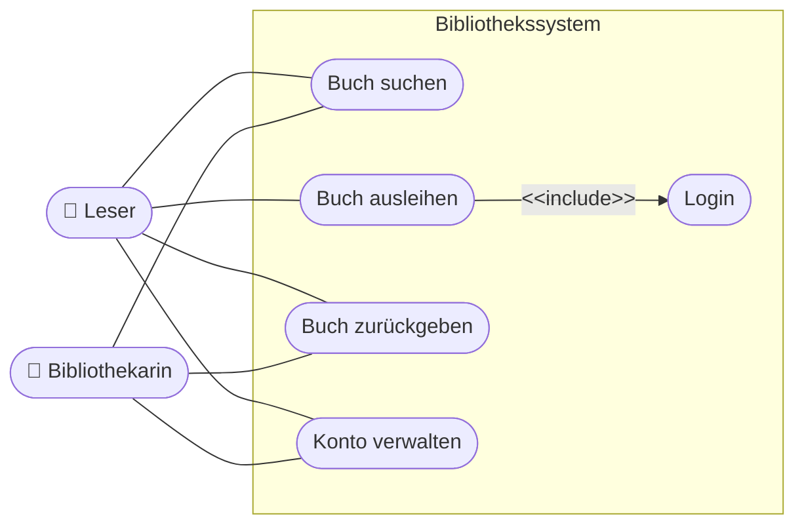
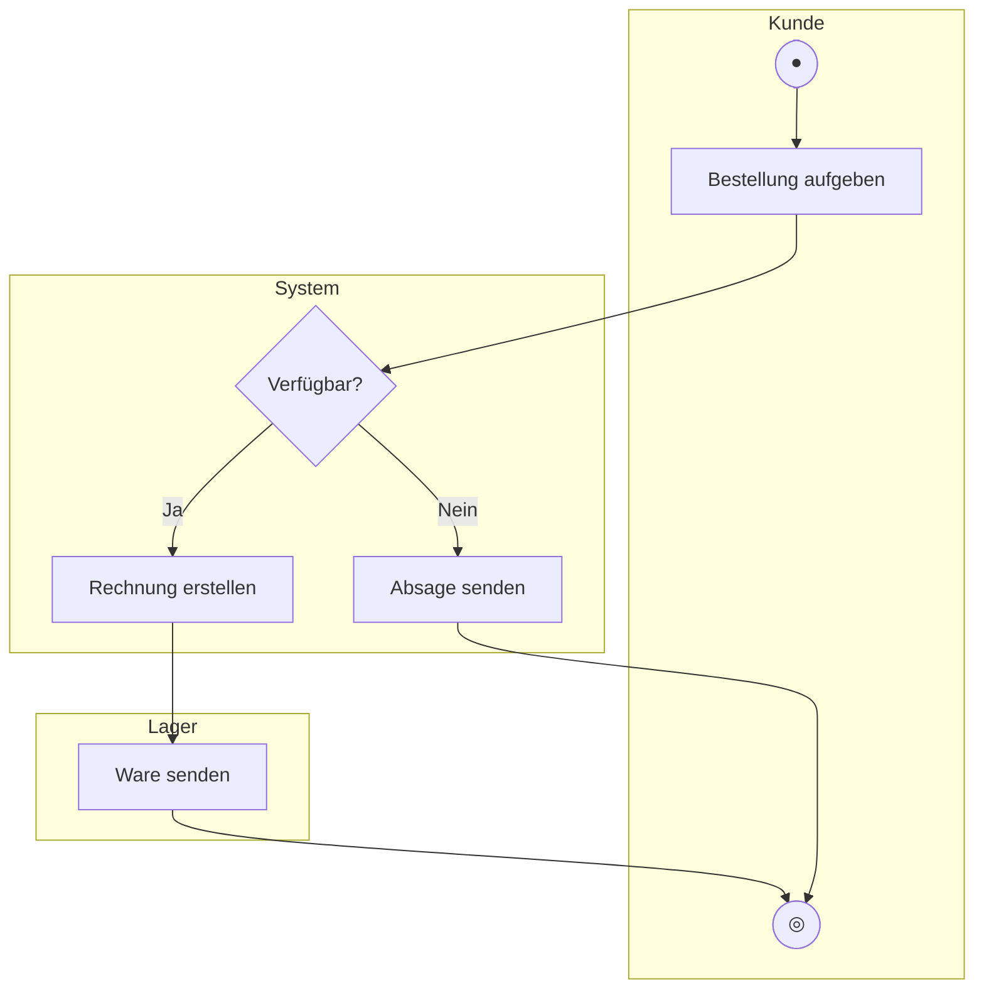
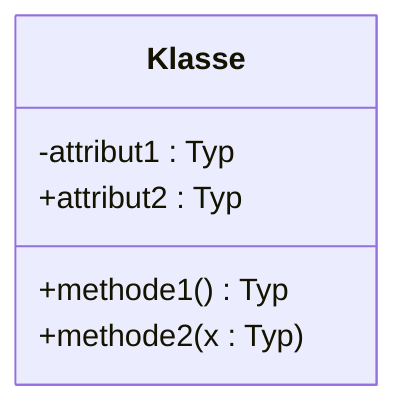
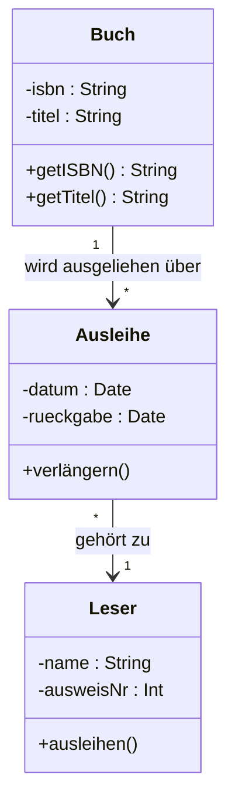
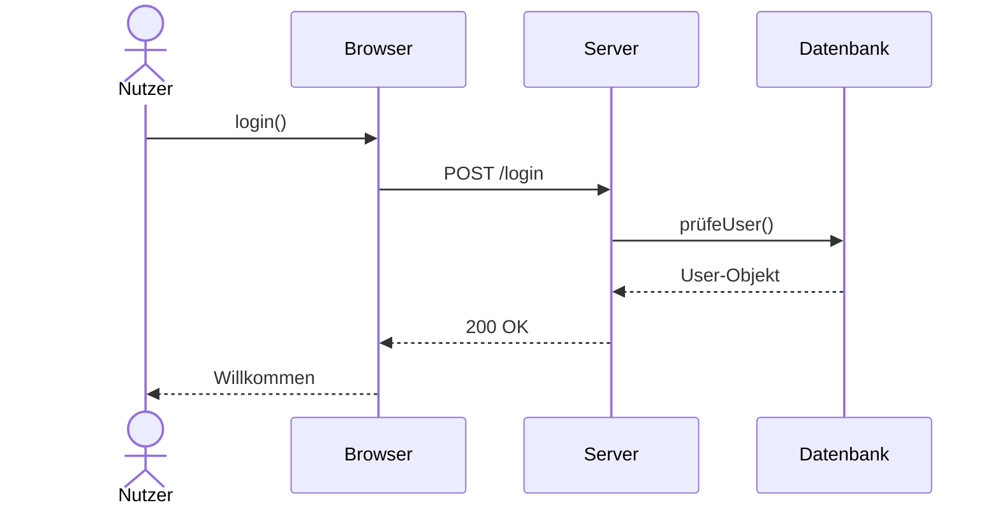

# Kapitel 8 – UML-Diagramme im Überblick

  

  

  

  

  

  

  

  

  

  

<h3>Was du in diesem Kapitel lernst</h3>

- Was UML ist und warum es als Standard existiert
- Welche vier Diagrammarten zentral sind: Use-Case-, Aktivitäts-, Klassen- und Sequenzdiagramm
- Wie du die Grundelemente jedes Diagrammtyps erkennst und liest
- Wie du für eine konkrete Aufgabe die passende UML-Darstellungsform auswählst

---

## So gehst du vor

1. Lies die Kapitelinhalte und achte auf die Symbole und deren Bedeutung.
2. Bearbeite die **Kurzübungen** der Reihe nach – von Grundlagen bis Experte.
3. Arbeite die **Workshop-Aufgabe** durch. Sie vertieft das Gelernte an einem zusammenhängenden Szenario.

---

## 8.1 Was ist UML?

**UML** (Unified Modeling Language) ist eine standardisierte grafische Sprache zur Modellierung von Software-Systemen. Sie wurde in den 1990er-Jahren von Grady Booch, Ivar Jacobson und James Rumbaugh entwickelt und ist heute ein ISO-Standard (ISO/IEC 19505).

UML ist **sprachunabhängig**: Ein UML-Diagramm beschreibt, was ein System tut oder wie es strukturiert ist – unabhängig davon, ob es in Java, PHP, C# oder einer anderen Sprache implementiert wird.

**Warum UML?**
- Einheitliche Notation für Entwickler, Analysten und Manager
- Kommunikation über Systemstrukturen ohne Quellcode
- Dokumentation, die auch nach Jahren noch verständlich ist
- Grundlage für automatische Code-Generierung (in fortgeschrittenen Werkzeugen)

UML umfasst über 13 Diagrammtypen. In der Praxis und in IHK-Prüfungen sind vier besonders wichtig.

---

## 8.2 Use-Case-Diagramm

Das **Use-Case-Diagramm** (Anwendungsfalldiagramm) zeigt, **wer** (Akteur) das System **wozu** (Anwendungsfall) nutzt. Es beschreibt das System aus der Außenperspektive.

### Elemente

| Element | Symbol | Bedeutung |
|---|---|---|
| **Systemgrenze** | Rechteck | Grenze des modellierten Systems |
| **Akteur** | Strichmännchen | Person oder System, das mit dem System interagiert |
| **Anwendungsfall** | Ellipse | Eine Funktion, die das System dem Akteur bietet |
| **Assoziation** | Linie | Akteur nutzt einen Anwendungsfall |
| **Include** | gestrichelte Pfeillinie `<<include>>` | AF enthält zwingend einen anderen AF |
| **Extend** | gestrichelte Pfeillinie `<<extend>>` | AF erweitert optional einen anderen AF |

### Beispiel: Bibliothekssystem

**Wann einsetzen?** Anforderungsphase – um zu zeigen, welche Funktionen das System bietet und wer sie nutzt.

---

## 8.3 Aktivitätsdiagramm

Das **Aktivitätsdiagramm** beschreibt den **Ablauf von Aktivitäten** – ähnlich einem PAP, aber mächtiger. Es kann Parallelverarbeitung, Verantwortlichkeitsbereiche (Swimlanes) und komplexe Verzweigungen darstellen.

### Elemente

| Element | Symbol | Bedeutung |
|---|---|---|
| **Startknoten** | Ausgefüllter Kreis | Beginn des Ablaufs |
| **Endknoten** | Kreis mit Ring | Ende des Ablaufs |
| **Aktion** | Abgerundetes Rechteck | Eine ausführbare Aktivität |
| **Entscheidungsknoten** | Raute | Verzweigung (Bedingung) |
| **Zusammenführung** | Raute | Mehrere Pfade laufen zusammen |
| **Gabelung** | Dicke waagrechte Linie | Start paralleler Aktivitäten |
| **Verbindung** | Dicke waagrechte Linie | Synchronisation paralleler Aktivitäten |
| **Swimlane** | Vertikal/horizontal geteilte Bereiche | Verantwortlichkeit (wer führt aus?) |

### Beispiel: Bestellprozess mit Swimlanes

**Wann einsetzen?** Wenn Abläufe mit Verzweigungen, Parallelität oder Verantwortlichkeiten modelliert werden sollen.

---

## 8.4 Klassendiagramm

Das **Klassendiagramm** ist das zentrale Strukturdiagramm der OOP. Es zeigt, welche **Klassen** ein System enthält, welche **Attribute und Methoden** sie haben und wie sie miteinander **in Beziehung** stehen.

### Klassen-Notation

_`-` = private, `+` = public, `#` = protected_

### Sichtbarkeiten

| Zeichen | Bedeutung |
|---|---|
| `+` | public – von überall zugreifbar |
| `-` | private – nur innerhalb der Klasse |
| `#` | protected – innerhalb der Klasse und Unterklassen |

### Beziehungstypen

| Beziehung | Symbol | Bedeutung |
|---|---|---|
| **Assoziation** | Linie | Klassen kennen sich |
| **Vererbung** | Pfeil mit offenem Dreieck | „ist ein" – Unterklasse erbt von Oberklasse |
| **Komposition** | Ausgefüllte Raute + Linie | „besteht aus" – Teil kann ohne Ganzes nicht existieren |
| **Aggregation** | Offene Raute + Linie | „enthält" – Teil kann ohne Ganzes existieren |
| **Abhängigkeit** | Gestrichelter Pfeil | Eine Klasse nutzt eine andere kurzfristig |

### Beispiel: Bibliothekssystem

**Wann einsetzen?** Entwurfsphase – um die statische Struktur des Systems zu modellieren.

---

## 8.5 Sequenzdiagramm

Das **Sequenzdiagramm** zeigt, wie **Objekte miteinander kommunizieren** – in welcher Reihenfolge Nachrichten (Methodenaufrufe) ausgetauscht werden. Es modelliert das dynamische Verhalten bei einem konkreten Ablauf.

### Elemente

| Element | Symbol | Bedeutung |
|---|---|---|
| **Akteur / Objekt** | Rechteck oben, gestrichelte Linie nach unten | Teilnehmer am Ablauf |
| **Lebenslinie** | Senkrechte gestrichelte Linie | Zeitachse des Objekts |
| **Aktivierungsbalken** | Schmales Rechteck auf Lebenslinie | Objekt ist aktiv |
| **Nachricht** | Pfeil | Methodenaufruf oder Rückgabe |
| **Rückgabe** | Gestrichelter Pfeil | Antwort auf eine Nachricht |

### Beispiel: Login-Vorgang

**Wann einsetzen?** Wenn die zeitliche Reihenfolge von Interaktionen zwischen Objekten dokumentiert werden soll.

---

## 8.6 Welches Diagramm wann?

| Frage / Situation | Diagramm |
|---|---|
| Welche Funktionen bietet das System? Wer nutzt sie? | Use-Case-Diagramm |
| Wie läuft ein Prozess ab? (mit Verzweigungen, Swimlanes) | Aktivitätsdiagramm |
| Welche Klassen gibt es? Wie sind sie strukturiert? | Klassendiagramm |
| Wie kommunizieren Objekte in einem konkreten Ablauf? | Sequenzdiagramm |

---

## Kurzübungen

{{ task(file="tasks/tag8_01.yaml") }}

{{ task(file="tasks/tag8_02.yaml") }}

{{ task(file="tasks/tag8_03.yaml") }}

---

## Workshop

{{ task(file="tasks/workshop_k8.yaml") }}
