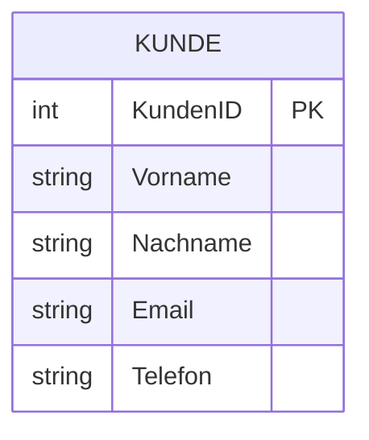
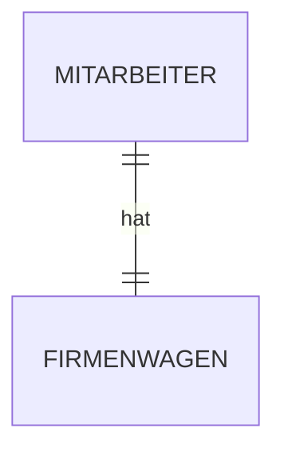
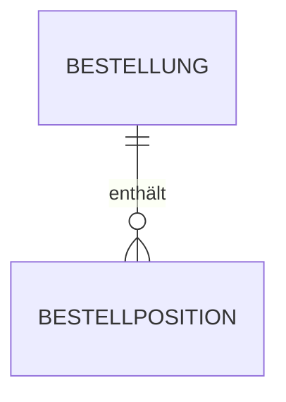
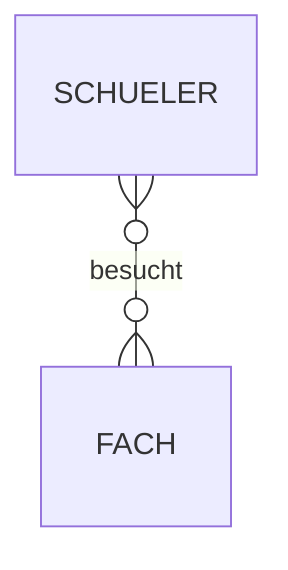
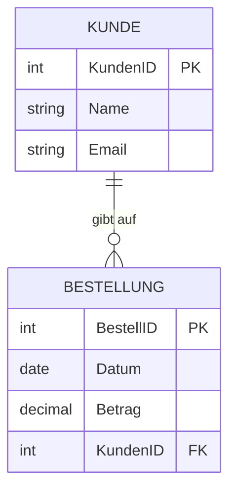
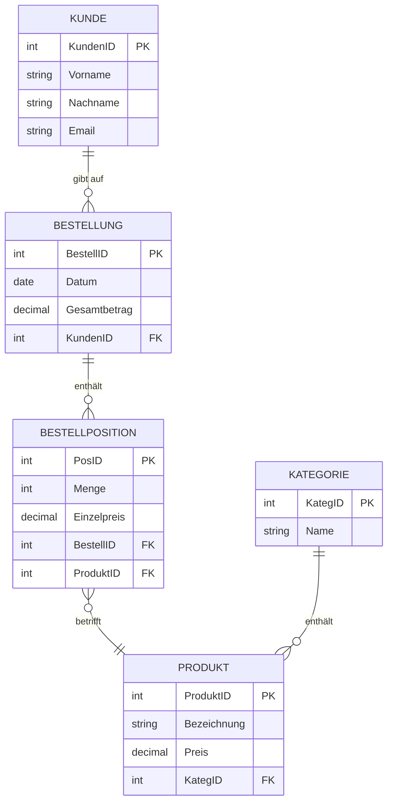

# Kapitel 9 – Entity-Relationship-Modell (ERM)

  

  

  

  

  

  

  

  

  

  

<h3>Was du in diesem Kapitel lernst</h3>

- Was ein Entity-Relationship-Modell (ERM) ist und wozu es dient
- Was Entitäten, Attribute und Beziehungen sind
- Was Kardinalitäten bedeuten (1:1, 1:n, m:n)
- Wie du ein einfaches ER-Diagramm liest und erstellt

---

## So gehst du vor

1. Lies die Kapitelinhalte und präge dir die Grundbegriffe ein.
2. Bearbeite die **Kurzübungen** der Reihe nach – von Grundlagen bis Experte.
3. Arbeite die **Workshop-Aufgabe** durch. Sie vertieft das Gelernte an einem zusammenhängenden Szenario.

---

## 9.1 Was ist ein Entity-Relationship-Modell?

Das **Entity-Relationship-Modell** (ERM, auch ER-Modell) ist ein konzeptionelles Datenbankmodell. Es beschreibt, **welche Daten** in einem System gespeichert werden sollen und **wie diese Daten miteinander in Beziehung** stehen – unabhängig von der konkreten Datenbanktechnologie.

Das ER-Modell wurde 1976 von Peter Chen entwickelt und ist bis heute das wichtigste Werkzeug für den Datenbankentwurf in der Analysephase.

**Warum ERM?**
- Kommunikation zwischen Fachabteilung und IT ohne Datenbankfachkenntnisse
- Grundlage für das spätere relationale Datenbankschema
- Fehler in der Datenstruktur früh erkennen und beheben

!!! info "Vertiefung in Modul 3"
    Dieses Kapitel gibt eine Einführung in das ERM. Die Umsetzung in konkrete Datenbankstrukturen (Normalisierung, SQL) wird im Modul „Datenbanken planen und differenzieren" vertieft.

---

## 9.2 Grundbegriffe: Entitäten und Attribute

### Entität

Eine **Entität** ist ein eindeutig identifizierbares Objekt der realen Welt, über das Daten gespeichert werden sollen.

**Beispiele:**
- Ein Kunde (z. B. „Maria Müller, Kundennummer 1234")
- Ein Produkt (z. B. „Laptop, Artikel-Nr. L-001")
- Eine Bestellung (z. B. „Bestellung Nr. 5678 vom 01.06.2026")

Gleichartige Entitäten werden zu einem **Entitätstyp** zusammengefasst. Im ER-Diagramm wird ein Entitätstyp als **Rechteck** dargestellt.

### Attribut

Ein **Attribut** beschreibt eine Eigenschaft einer Entität. Im ER-Diagramm werden Attribute als **Ellipsen** (Chen-Notation) oder als Liste im Rechteck (Crow's-Foot-Notation) dargestellt.

**Beispiel – Entitätstyp „Kunde" mit Attributen:**

### Primärschlüssel

Der **Primärschlüssel** (PK, *Primary Key*) ist ein Attribut (oder eine Kombination), das eine Entität eindeutig identifiziert. Jede Entität muss einen Primärschlüssel haben.

| Attribut | Geeignet als PK? | Begründung |
|---|---|---|
| Kundennummer | ✅ Ja | Eindeutig, unveränderlich |
| E-Mail-Adresse | ⚠️ Bedingt | Kann sich ändern |
| Vorname | ❌ Nein | Nicht eindeutig |
| Name + Geburtsdatum | ⚠️ Bedingt | Kombination meist eindeutig, aber nicht garantiert |

---

## 9.3 Beziehungen (Relationships)

Eine **Beziehung** beschreibt, wie zwei Entitätstypen miteinander verknüpft sind. Im ER-Diagramm wird eine Beziehung als **Raute** (Chen-Notation) dargestellt.

**Beispiele:**
- Ein Kunde **gibt auf** eine Bestellung
- Ein Produkt **gehört zu** einer Kategorie
- Ein Lehrer **unterrichtet** mehrere Schüler

Beziehungen können selbst **Attribute** haben. Zum Beispiel hat die Beziehung „Kunde kauft Produkt" das Attribut „Menge".

---

## 9.4 Kardinalitäten

Die **Kardinalität** einer Beziehung gibt an, wie viele Entitäten einer Seite mit wie vielen Entitäten der anderen Seite verknüpft sein können.

### 1:1-Beziehung

Eine Entität auf der linken Seite ist mit **genau einer** Entität auf der rechten Seite verknüpft – und umgekehrt.

**Beispiel:** Ein Mitarbeiter hat genau **einen** Firmenwagen. Ein Firmenwagen gehört genau **einem** Mitarbeiter.

**Wann kommt 1:1 vor?** Selten – oft können die Tabellen zusammengeführt werden.

### 1:n-Beziehung

Eine Entität auf der linken Seite ist mit **mehreren** Entitäten auf der rechten Seite verknüpft. Aber jede Entität rechts gehört zu **genau einer** links.

**Beispiel:** Eine Bestellung enthält **mehrere** Bestellpositionen. Jede Bestellposition gehört zu **genau einer** Bestellung.

**Das häufigste Muster** in relationalen Datenbanken.

### m:n-Beziehung

Eine Entität links ist mit **mehreren** rechts verknüpft – und umgekehrt.

**Beispiel:** Ein Schüler besucht **mehrere** Fächer. Ein Fach wird von **mehreren** Schülern besucht.

**Hinweis:** m:n-Beziehungen müssen bei der Umsetzung in ein relationales Datenbankschema durch eine **Zwischentabelle** (Verknüpfungstabelle) aufgelöst werden.

### Kardinalitäten im Überblick

| Typ | Leseweise | Beispiel |
|---|---|---|
| **1:1** | Genau einem – genau einem | Mitarbeiter ↔ Firmenwagen |
| **1:n** | Einem – mehreren | Bestellung ↔ Bestellpositionen |
| **n:1** | Mehreren – einem | (Umkehrung von 1:n) |
| **m:n** | Mehreren – mehreren | Schüler ↔ Fächer |

---

## 9.5 Notationen

Es gibt verschiedene Notationen für ER-Diagramme. Die zwei wichtigsten:

### Chen-Notation (klassisch)

- Entitätstypen: **Rechtecke**
- Attribute: **Ellipsen**
- Beziehungen: **Rauten**
- Kardinalitäten: Beschriftung an den Verbindungslinien (1, N, M)

### Crow's-Foot-Notation (modern, praxisnah)

- Entitätstypen: **Rechtecke** mit Attributliste
- Keine gesonderten Attribute
- Kardinalitäten: Symbolische Notation am Ende der Linien (Krähenfuß = „viele")

| Symbol | Bedeutung |
|---|---|
| `\|\|` | Genau eins (Pflicht) |
| `o\|` | Null oder eins (optional) |
| `\|{` | Eins oder viele |
| `o{` | Null oder viele |

**Beispiel in Crow's-Foot:**

---

## 9.6 Vollständiges Beispiel: Online-Shop

**Anforderungen:**
- Kunden können mehrere Bestellungen aufgeben
- Jede Bestellung enthält eine oder mehrere Positionen
- Jede Position bezieht sich auf genau ein Produkt
- Produkte gehören zu genau einer Kategorie; eine Kategorie hat mehrere Produkte

---

## Kurzübungen

{{ task(file="tasks/tag9_01.yaml") }}

{{ task(file="tasks/tag9_02.yaml") }}

{{ task(file="tasks/tag9_03.yaml") }}

---

## Workshop

{{ task(file="tasks/workshop_k9.yaml") }}
